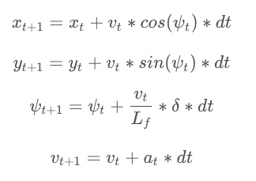

# Rubric

## Your code should compile.
* Code Compiles

## The Model
* The state of the car is denoted by the x (x position), y (y position), v (velocity) , psi (orientation), cte (Cross Treck Error), eps (orientation error). The actuators are what the model uses to control the car. The actuators are the steering angle and the acceleration. We constrain the values to -1 to 1 acceleration and -25 to 25 degrees. The update equations are calculated by the following equations.

    

## Timestep Length and Elapsed Duration (N & dt)
* I started with the timestep length and elapsed times originally to the 25 timestep lengths and .05 elapsed time. I tweeked the values and found I had better latency results with N = 10 and dt = .1. The smaller the elapsed time the more precise the model is, but the slower the latency. The larger the timestep the more future predictions we make. This will cost more memory and computation power.

## Polynomial Fitting and MPC Preprocessing
* I convert the waypoint locations to car coordinates and then I fit the polynomial at 47 of main.cpp.

## Model Predictive Control with Latency
* I achived 100 milliscond latency by the timestep length and elapsed duration 

## The vehicle must successfully drive a lap around the track.
* The vehicle makes it around the track without leaving the road surface.
